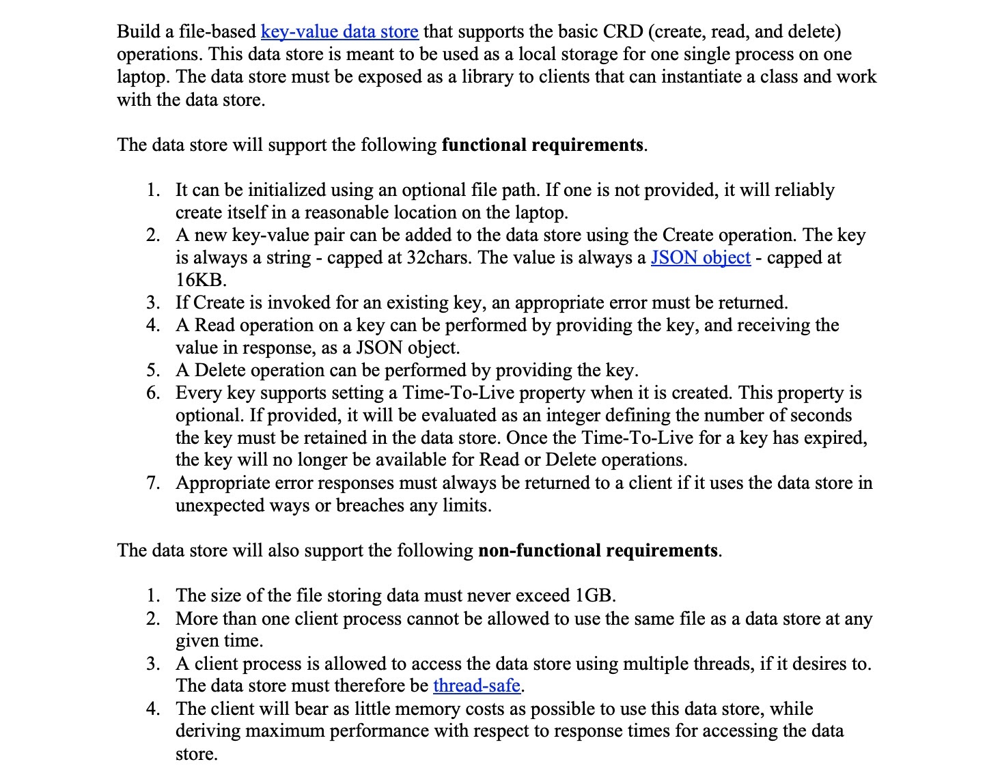

# file-datastore-python
A python program to demonstrate file datastore.

This repo contains the code to submit for Freshworks.

A file based key-value datastore to store in a local machine and use it.

### Problem Statement


### Operations Performed
1. Create a new key-value pair
2. Read an existing key-value pair based on user's input of key
3. Update an existing key-value pair based on user's input of key and the value to update the key with.
4. Delete an existing key-value pair.

### Installation Guide
To install the library run
```
pip install filedatastorelib-0.1.0-py3-none-any.whl
```
on the terminal.
The .whl file is present inside the dist folder. 

Then in the app.py file you can run the program by importing the library once it's installed via pip. 

Refer **app.py** file to see how to initialise your code to use with the library.

### Functions Available
```
def keyCheck():
    
    Function to check whether the key entered by the use is valid or not.
    Returns the key entered by the user if it's a valid one.
    
```
```
def startOperations(path):
    
    Takes a single argument path that contains the path provided by the user to save the datastore file.
    Returns nothing.
    
```

### Testing
Only manual testing has been done to fulfill the requirements specified in the problem statement.

### Note
TTL has not been implemented.
